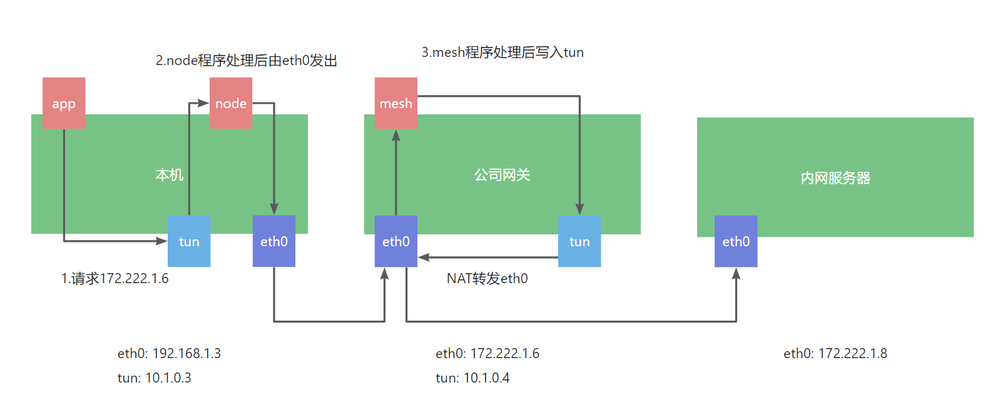
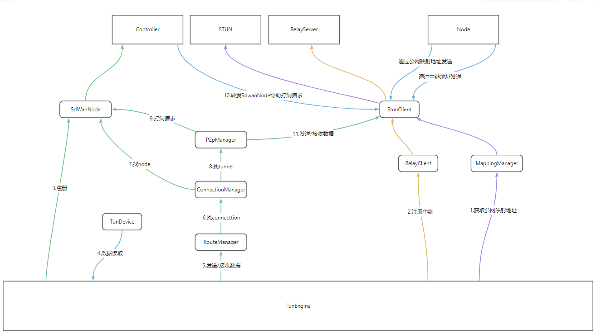
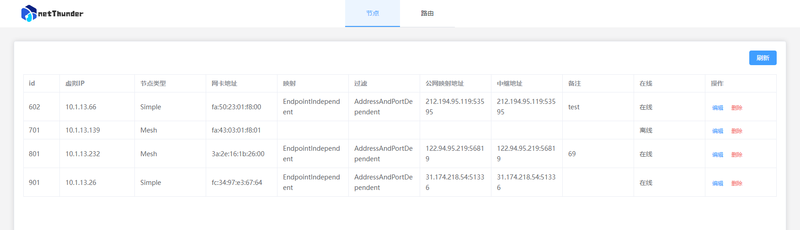

# netThunder


netThunder是一款私有SD-WAN（软件定义广域网）解决方案，专为满足用户的网络需求而设计。它将点对点连接和端到端加密传输相结合，为用户提供卓越的网络性能和安全性。

# netThunder与传统VPN的对比

在传统的VPN模型中，所有内容都集中在一个受保护的网络上，所有客户端都连接到一个VPN服务器。

随着连接数量的不断增加，VPN服务器很容易过载。即使服务器短暂宕机，也可能导致昂贵的系统中断，以及远程团队无法工作。

传统的VPN所有流量都经过VPN服务器，导致网络延迟和增加的流量使用。

而netThunder可以通过dashboard配置流量的走向，将远程团队和机房组成一个自己定义的私有网络。

又不影响正常的上网与游戏。

VPN：是单隧道，一次只能连接一个机房，正常上网的流量也要走VPN服务器端发出。

SD-WAN：是运行在本机的软路由，可以同时连接多个机房，并且正常上网走本机的流量。


### 特点：

* **点对点连接**
  
netThunder允许用户建立点对点连接，将分支机构、远程团队和合作伙伴网络集成在一起。这种直接连接消除了网络拓扑中的冗余，提高了性能和效率。

* **端到端加密传输**
  
安全性是我们的首要任务。我们的SD-WAN解决方案提供ECDH-AES算法做端到端的加密传输，确保敏感数据在传输过程中得到保护，从而降低了数据泄漏的风险。

* **集中化管理**
  
netThunder集成了强大的集中化管理工具，使您能够轻松管理和监视整个网络，包括流量、安全策略和性能指标。

* **动态负载均衡**
  
我们的SD-WAN解决方案可自动调整流量路由，以实现最佳性能。这有助于避免拥塞和提供出色的用户体验。

* **高度可扩展**
  
无论您的网络规模如何增长，我们的产品都能够轻松适应变化。您可以根据需要扩展您的网络，无需担心性能下降。

### 原理:


SD-WAN（Software-Defined Wide Area Network）中使用的TUN设备是一种虚拟网络设备，它允许将数据包从一个物理网络接口路由到另一个网络接口，通常用于创建安全的隧道，实现加密、隔离和路由功能。以下是SD-WAN中使用的TUN设备的工作原理：

虚拟TUN设备创建： SD-WAN控制器或设备会在操作系统内核中创建一个虚拟的TUN/TAP（Tunnel）设备。TUN代表网络层（Layer 3）设备，而TAP代表数据链路层（Layer 2）设备。

路由规则配置： SD-WAN系统会配置一组路由规则，这些规则定义了数据包如何在物理接口和TUN设备之间路由。这些规则可能基于目的地IP地址、子网、端口等条件。

隧道加密： 数据包被发送到TUN设备时，它们可能需要加密以确保安全传输。这通常涉及使用加密协议（例如IPsec）来将数据包加密为隧道内的安全数据。

TUN设备中转： 数据包被写入TUN设备后，它们被传输到SD-WAN设备内核的虚拟网络栈。从那里，它们可以根据路由规则进行进一步处理。

路由和策略： SD-WAN设备内核中的路由和策略引擎将决定如何处理数据包。这可能包括决定是否将数据包传输到其他网络接口，进行加速、压缩、分流或其他网络优化操作。

数据包传输： 数据包可能被进一步路由到物理接口以达到其最终目的地。这可能是通过WAN链路或其他网络连接。

反向操作： 在接收到远程站点的响应数据包后，SD-WAN设备将数据包写入TUN设备，然后通过TUN设备发送回到本地站点。这包括解密数据（如果已加密），然后通过本地网络栈路由。

总的来说，SD-WAN中使用的TUN设备充当了虚拟隧道接口，通过它，数据包可以被加密、路由和传输，从而实现了SD-WAN的核心功能，如安全连接、流量管理和优化。这种虚拟化网络设备的使用允许SD-WAN系统更灵活地管理和优化网络流量，提供更好的性能和安全性。

### 组件关系



### 部署
1.在公网云主机上部署controller
```yaml
server:
  #dashboard网页地址
  port: 8080
sdwan:
  controller:
    #控制器端口TCP
    port: 8081
    #定义地址池
    cidr: 10.1.0.0/20
    # arp过期时间second
    sdArpTTL: 300
    # 数据库路径
    dbPath: ${user.dir}/derby.db
  relay:
    #中继端口UDP
    port: 8082
    timeout: 30000

```
2.在需要访问的机房部署sdwan-node(Mesh模式)
```yaml
sdwan:
  node:
    #控制器地址
    controllerServer: 127.0.0.1:8081
    connectTimeout: 30000
    mtu: 1400
    #stun服务器地址，这里使用小米的
    stunServer: stun.miwifi.com:3478
    #中继服务器地址
    relayServer: 127.0.0.1:8082
    #配置本机的ip，由于有多个网卡需要配置
    localIP: 192.168.1.2
```
3.本机启动sdwan-node
```yaml
sdwan:
  node:
    #控制器地址
    controllerServer: 127.0.0.1:8081
    connectTimeout: 30000
    mtu: 1400
    #stun服务器地址，这里使用小米的
    stunServer: stun.miwifi.com:3478
    #中继服务器地址
    relayServer: 127.0.0.1:8082
    #配置本机的ip，由于有多个网卡需要配置
    localIP: 10.22.6.3
```
4.在dashboard中定义路由

查看在线的node信息



配置路由信息

